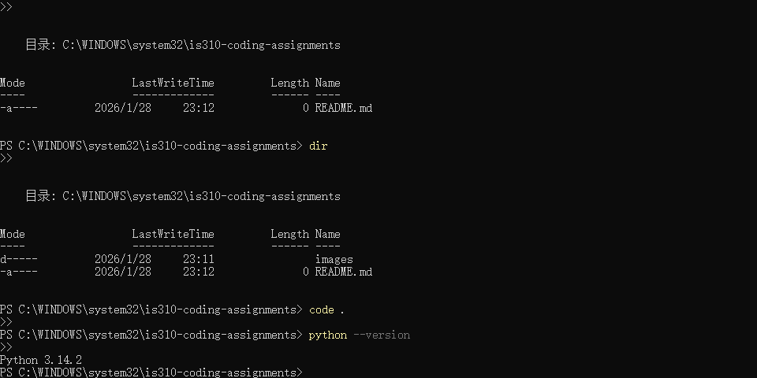
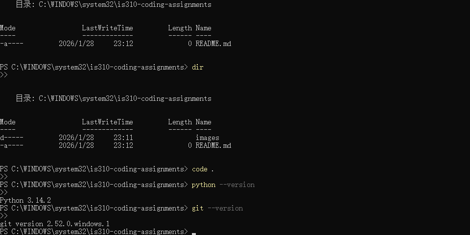
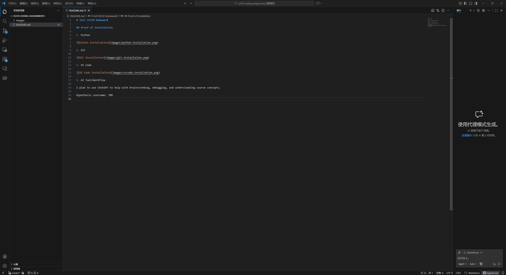

# Init IS310 Homework

## Proof of Installation

1. Python

2. Git

3. VS Code

4. AI Tool/Workflow

I plan to use ChatGPT to help with brainstorming, debugging, and understanding course concepts.

Hypothesis username: GlorysingRY
