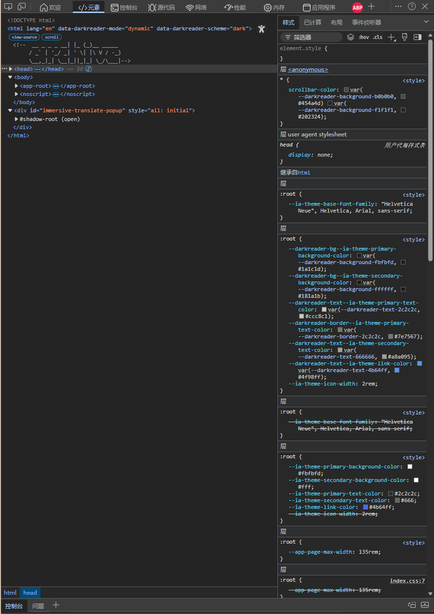
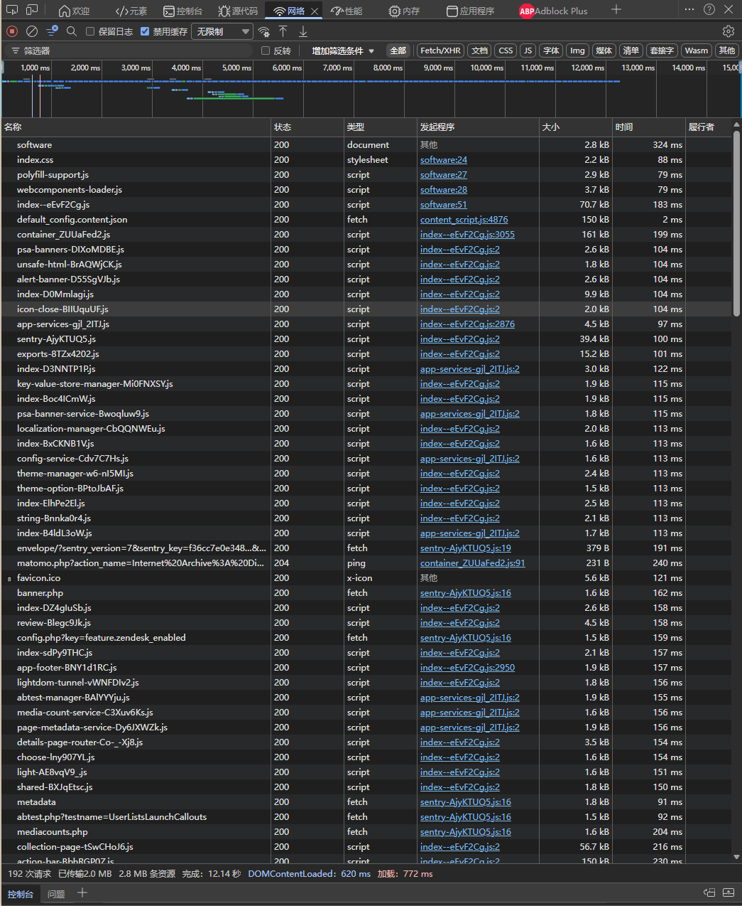

# Homework: Source and Style

## Assignment 1: Inspecting the Cultural Web

### Website Selected
Name: Internet Archive – Software & Video Game Collection  
Link: https://archive.org/details/software  

### Web Technologies Used (Evidence-Based)
- The page loads an HTML document first.
- Styling is handled through external CSS (example: `https://archive.org/offshoot_assets/index.css`).
- The site relies heavily on JavaScript bundles (`*.js`) for rendering and interaction.
- The HAR file shows Web Components polyfills and Lit-related assets (e.g., `webcomponents-loader.js`, `lit/polyfill-support.js`), suggesting a modern front-end architecture.

### Who Built This Website?
- Built and maintained by the Internet Archive (nonprofit organization).
- GitHub organization: https://github.com/internetarchive  
- The scale of repositories and contributors indicates a team/institutional effort rather than a single person.

### Screenshots
(Add screenshots below once saved in images folder)
- 
- 

### Reflection
Inspecting this site shows that digital archives depend on modern web infrastructure (bundled JavaScript, component systems, and continuous maintenance). “Access” to cultural materials is shaped by ongoing technical choices and platform compatibility.